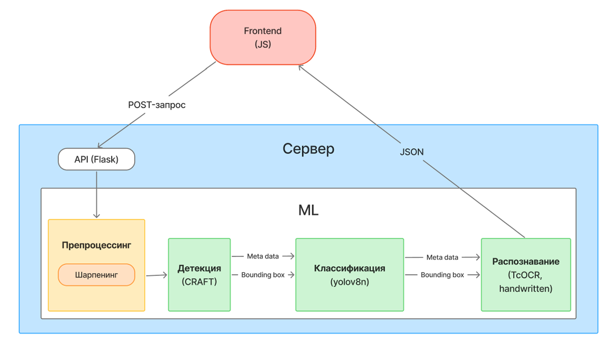
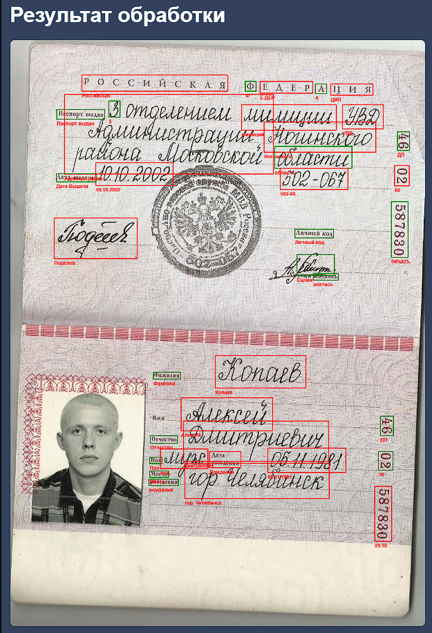
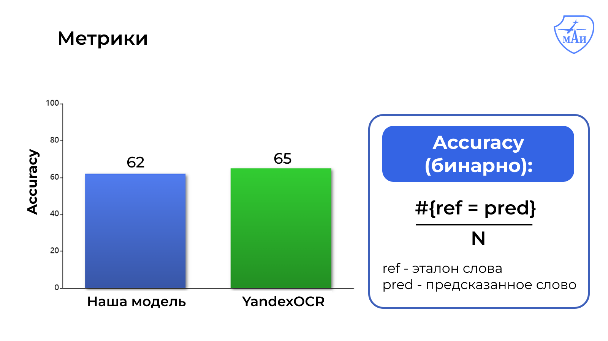

# Handwritten Text Recognition Service

Сервис для распознавания рукописного и печатного текста на фотографиях. Создан в рамках решения кейса от компании "Т1" в школе Математического Моделирования МАИ 2025 г.

## Как это работает

Проект реализует пайплайн распознавания текста из изображения. 



**Препроцессинг**
- Увеличивает резкость фото (шарпенинг) для улучшения работы детектора.

**Детектор (EasyOCR + CRAFT)**
- Детектор получает улучшенную фотографию. Определяет области с текстом, вырезает их по прямоугольному контуру (создаёт кроп) и помещает их во временную папку. Также к каждому кропу прилагаются метаданные с полями id, text, coordinates. 

**Классификатор (YOLOv8n)**
Принимает JSON и классифицирует кропы по свойству "рукописный / не рукописный", добавляя к соответствующему объекту в метаданных флаг `is_handwritten: 1` (рукописный) или `0` (печатный).

**Модели распознавания (TrOCR)**   
- Получает метаданные и кропы из временной папки.
- Распознаёт текст на кропах, и записывает в соответствующее поле text в метаданных результаты распознавания.
- Формирует и отправляет JSON файл фронтенду.

**Выходной результат**
   - JSON-файл с распознанными текстами, их местоположениями на документе и флагами "рукописный / не рукописный".
   - Исходное изображение с разметкой областей рукописного и печатного текста цветом разными цветами формируется на фронтенде.

## Технологии

- Python 3.10+
- [EasyOCR (CRAFT)](https://github.com/JaidedAI/EasyOCR)
- [YOLOv8n (fine-tuned on handwritten texts)](https://huggingface.co/armvectores/yolov8n_handwritten_text_detection)
- [Hugging Face TrOCR-ru (fine-tuned on Cyrillic Handwritting Dataset)](https://huggingface.co/kazars24/trocr-base-handwritten-ru)
- Flask (REST API)
## Метрики

## Запуск

```bash
git clone <repository-url>
cd <project-directory>
docker compose up
```
## Примечание
Для максимальной скорости работы запускать проект на сервере с графическим процессором Nvidia. 
## Контакты

Если есть вопросы или предложения, пишите (Telegram):
- Иван Королев - @vanIkorolev
- Ринат Юсуфов - @Nevergard
- Александра Серякова - @ssanchellaa
- Хоанг Нгуен - @tng00


# Презентация
https://docs.google.com/presentation/d/1ItpyIFZq2SKi2tBiSUhnj8H-rr40zpw6/edit?usp=sharing&ouid=100701928440453967590&rtpof=true&sd=true
# Research document
https://docs.google.com/document/d/18wV1jk8oKdsMyVx5ZEvHY-37ssDxNp4VH76rGzV2Emk/edit?usp=sharing
